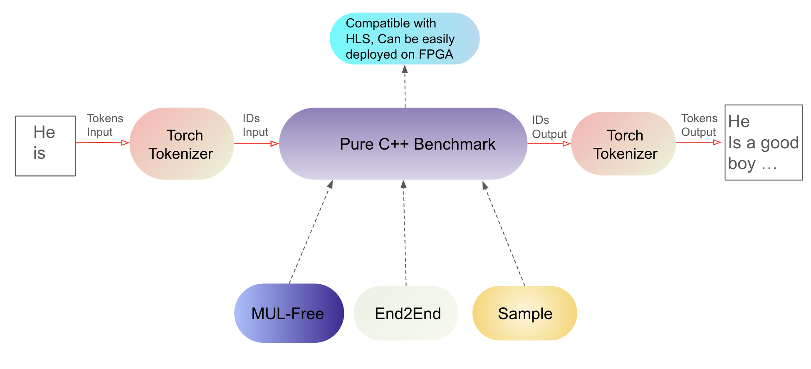
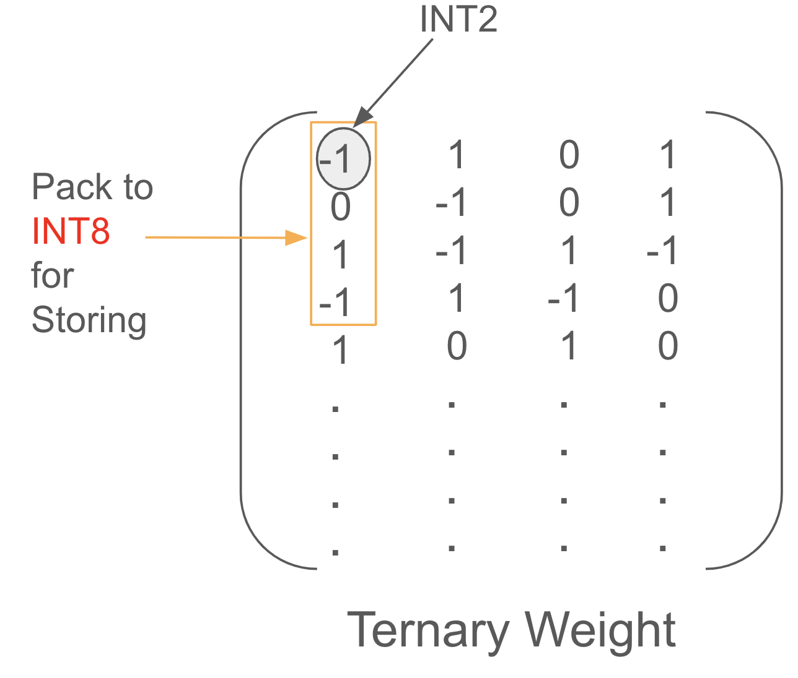

# Bitnet-C++-benchmark

This repository provides a single-thread, end-to-end C++ implementation of the Bitnet (1.58-bit weight) model, based on [`BitNet.cpp`](https://github.com/microsoft/BitNet) and [`1bitLLM/bitnet_b1_58-large`](https://huggingface.co/1bitLLM/bitnet_b1_58-large/tree/main). This implementation avoids complex optimizations for specific CPU architectures, making it straightforward and adaptable for hardware synthesis and FPGA deployment.

## High-Level Intro
<h3 align="center">Bitnet-C++-benchmark Workflow:</h3>
<p align="center">
  
</p>

<h3 align="center">Weight Packing:</h3>
<p align="center">
  
</p>

## Key Features
- **Easy to be transferred to HLS for FPGA deployment:** Unlike [`BitNet.cpp`](https://github.com/microsoft/BitNet), which is optimized for specific CPU architectures, this repository provides pure C++ code without calling other libraries to implement end-to-end causal inference. This simplified design is suitable for High-Level Synthesis (HLS) and deployment on FPGA.
- **8-bit Activation Quantization:** Efficiently quantizes activations on the fly using 8-bit precision.
- **Mul Free Linear Kernel:** Instead of using floating-point GEMM with fake quantization (as in the [Torch implementation](https://huggingface.co/1bitLLM/bitnet_b1_58-large/tree/main)), this repository provides a multiplication-free kernel.
- **Prefill and Decode Separation:** The inference process is split into prefill and decode stages, enhancing performance.


## Dependencies
- C++17 compiler
- Python 3.10
- PyTorch
- Numpy
- sentencepiece
- transformers

## How to Build and Run

1. **Clone the Repository:**
   ```bash
   git clone https://github.com/kaizizzzzzz/Bitnet-C-benchmark.git
   cd Bitnet-C-benchmark
2. **Download the Model File:**
    Download the processed model file:

    ```bash
    wget https://huggingface.co/kaixin123/bitnet-1.58-processed/resolve/main/model.bin
    ```
    Alternatively, download the safetensor file from the [original model repository](https://huggingface.co/1bitLLM/bitnet_b1_58-large/tree/main) and use [`model_preprocess/preprocess.py`](model_preprocess/preprocess.py) to convert it for this C++ implementation. Place `model.bin` in the `Bitnet-C-benchmark/` directory.
3. **Set up Environment:**
    ```bash
    source setup_conda_env.sh
4. **Compile the Code:**
    ```bash
    make
5. **Encode tokens:**
    ```bash
    python encode.py --prompt "Cornell University is"
6. **Run the casual inference:**
    
    Prefill+Decode(default)
    ```bash
    ./inference/inference --gen_tokens 8 --temp 0.8 --topk 5
    ```
    Only prefill
    ```bash
    ./inference/inference --gen_tokens 8 --temp 0.8 --topk 5 --prefill_only true
    ```
7. **Decode IDs:**
    ```bash
    python decode.py


## Example Output
1. **Prefill+Decode(default):**
```plaintext
ky427@zhang-capra-xcel:Bitnet-C-benchmark$ python encode.py --prompt "Cornell University is"

ky427@zhang-capra-xcel:Bitnet-C-benchmark$ ./inference/inference
Encoded_ID: 1 11655 514 3014 338
Prefill Starts: >>>>>>>>>>>>>>
Encoded_ID now: 1 11655 514 3014 338 263
Inference time for 0th token:75s
Decoding Starts: <<<<<<<<<<<<<<<
Encoded_ID now: 1 11655 514 3014 338 263 2024
Inference time for 1th token:15s
Encoded_ID now: 1 11655 514 3014 338 263 2024 16372
Inference time for 2th token:14s
Encoded_ID now: 1 11655 514 3014 338 263 2024 16372 5982
Inference time for 3th token:14s
Encoded_ID now: 1 11655 514 3014 338 263 2024 16372 5982 297
Inference time for 4th token:14s
Encoded_ID now: 1 11655 514 3014 338 263 2024 16372 5982 297 306
Inference time for 5th token:14s
Encoded_ID now: 1 11655 514 3014 338 263 2024 16372 5982 297 306 386
Inference time for 6th token:14s
Encoded_ID now: 1 11655 514 3014 338 263 2024 16372 5982 297 306 386 11989
Inference time for 7th token:14s
Encoded_ID now: 1 11655 514 3014 338 263 2024 16372 5982 297 306 386 11989 29892
Inference time for 8th token:14s
Encoded_ID now: 1 11655 514 3014 338 263 2024 16372 5982 297 306 386 11989 29892 1570
Inference time for 9th token:14s
Encoded_ID now: 1 11655 514 3014 338 263 2024 16372 5982 297 306 386 11989 29892 1570 3088
Inference time for 10th token:14s
Encoded_ID now: 1 11655 514 3014 338 263 2024 16372 5982 297 306 386 11989 29892 1570 3088 29892
Inference time for 11th token:14s

Total latency: 230s
Inference Speed: 19 seconds / token

ky427@zhang-capra-xcel:Bitnet-C-benchmark$ python decode.py 
Cornell University is a private University located in Ithaca, New York.
```

2. **Prefill only(much slower):**
It is getting slower and slower when the sequence is longer
```plaintext
ky427@zhang-capra-xcel:Bitnet-C-benchmark$ python encode.py --prompt "Lebron James is"

ky427@zhang-capra-xcel:Bitnet-C-benchmark$ ./inference/inference --gen_tokens 8 --prefill_only true
Encoded_ID: 1 9388 1617 5011 338 
Always Prefill: >>>>>>>>>>>>>>
Encoded_ID now: 1 9388 1617 5011 338 1250 
Inference time for 0th token:75s
Encoded_ID now: 1 9388 1617 5011 338 1250 297 
Inference time for 1th token:91s
Encoded_ID now: 1 9388 1617 5011 338 1250 297 27249 
Inference time for 2th token:106s
Encoded_ID now: 1 9388 1617 5011 338 1250 297 27249 322 
Inference time for 3th token:122s
Encoded_ID now: 1 9388 1617 5011 338 1250 297 27249 322 540 
Inference time for 4th token:141s
Encoded_ID now: 1 9388 1617 5011 338 1250 297 27249 322 540 30010 
Inference time for 5th token:153s
Encoded_ID now: 1 9388 1617 5011 338 1250 297 27249 322 540 30010 29879 
Inference time for 6th token:170s
Encoded_ID now: 1 9388 1617 5011 338 1250 297 27249 322 540 30010 29879 2675 
Inference time for 7th token:185s

Total latency: 1043s
Inference Speed: 130 seconds / token

ky427@zhang-capra-xcel:Bitnet-C-benchmark$ python decode.py 
Lebron James is back in Cleveland and he’s going
```